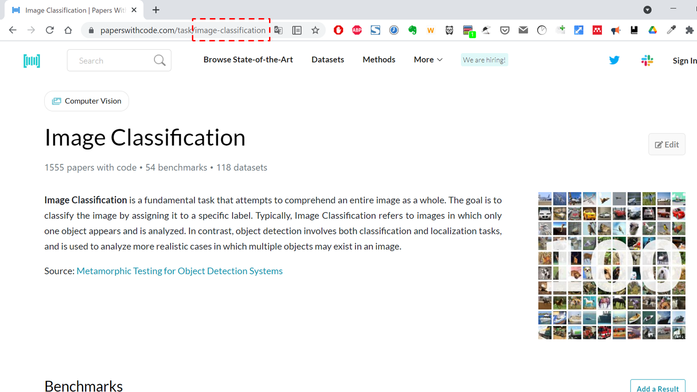

# Papers_with_Code_bot

Papers_with_code_bot is a bot for notifying Slack of SOTA updates on the web using GitHub Actions.

## Descriptions

[Browse State-of-the-Art](https://paperswithcode.com/sota) is a very informative website where SOTA for machine learning is summarized. Papers_with_Code_bot checks the SOTA updates of some tasks on the website every day and notifies Slack using Github Actions when they are updated. The notifications include the model, the paper that proposed it, and its URL before and after the SOTA update.


## Requirements

- Ubuntu 18.04
- Python 3.6.9
- pip 21.1.2
- beautifulsoup4 4.9.3
- lxml 4.6.3
- pandas 1.1.5
- requests 2.25.1

## Usage

You can choose any kind of task on [Browse State-of-the-Art](https://paperswithcode.com/sota). You should check the URL for each task and set the last part of it (as shown in the red dotted frame below) as `tasks` in `config.yaml`. (the defaults are `['image-classification', 'object-detection']`)



If csv files don't exist when the code is executed, they will be created but no message will be sent to Slack.
### GitHub Actions

Set as follows:

- your incoming webhook url as an environment variable in your repository (required)
- Slack notification time in `.github/workflow/cron.yml` (optional, the default is midnight UTC)

```
$ python main.py
```

### Debug

```
$ python main.py --slack_id [your_incoming_webhook_url] --needsInitialCsv [bool]
```

- Argument: 
    - slack_id: (str) Your incoming webhook url
    - needsInitialCsv: (bool) Whether you need initial csv files or not

## License

[MIT](https://choosealicense.com/licenses/mit/)
